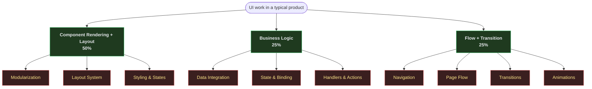

# Source-crafter

A platform-agnostic, AI-friendly way to build UIs. Describe the interface in YAML, let the engine render it on the browser, Android, iOS, or terminal — same source, native output on every surface.

## What source-crafter covers

Every UI product is a mix of three concerns. Source-crafter takes the two big ones off your plate and gives you a clean surface for the third.

**Component Rendering + Layout (50%)** and **Flow + Transition (25%)** are what the engine owns. You describe them in YAML — the engine parses, validates, lays out, and drives the platform adapter. **Business Logic (25%)** stays yours: you write providers to fetch data and handlers to run business rules, the engine wires them in by name.

Net effect: the mechanical 75% of a typical UI shrinks to a folder of YAML files, and the 25% that's actually your product stays in code you control.

## Documentation

Three docs, read in this order:

- [**docs/philosophy.md**](./docs/philosophy.md) — why this exists, who it's for, what's in scope and what isn't.
- [**docs/design.md**](./docs/design.md) — how it works under the hood: YAML → Rust engine → render plan → platform adapter → native UI.
- [**docs/roadmap.md**](./docs/roadmap.md) — where it's going: POC → MVP → Enhancements → Moderation, with concrete checkpoints.
