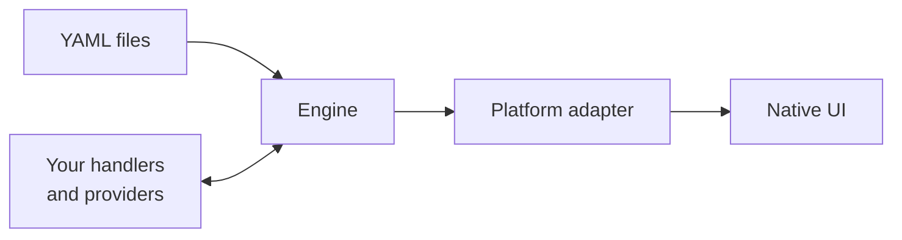
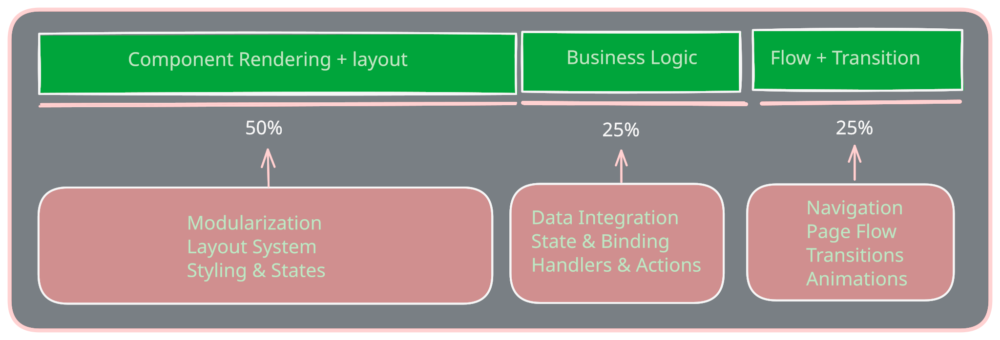
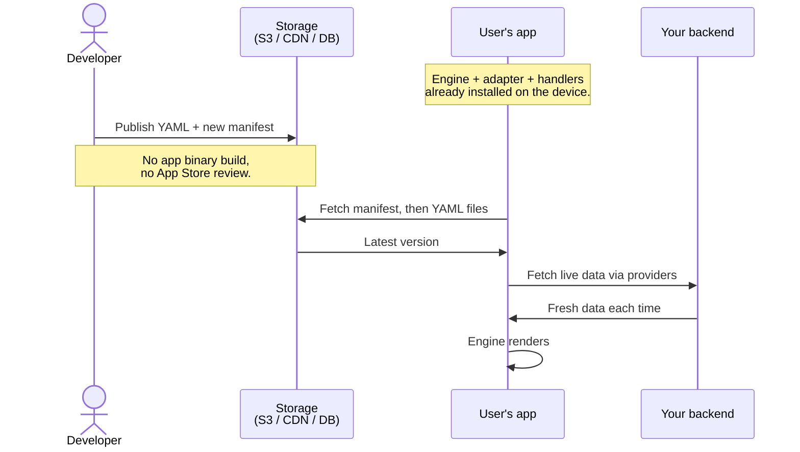

# Source-crafter — Design

The way the system works under the hood is fairly simple. The YAML file describing the UI is read by an engine written in Rust. The engine parses it, validates it, and produces a normalized render plan that captures everything needed to draw the UI. A platform-specific adapter then takes the render plan and produces the actual UI on the device. The engine is identical across every platform; only the adapter changes.

Component rendering happens through a small set of atomic primitives — box, text, image, click-region, edit-field, scroll, group, and form. Everything else is built from these. A button, for example, is just a box with a text inside it wrapped in a click-region. A composite primitive defined in YAML is reduced to atomic primitives before the render plan reaches the adapter. The adapter then turns each atomic primitive into a real platform UI element — a DOM node on the web, a Compose composable on Android, a SwiftUI view on iOS.

Layout is described through properties on the container components themselves. A box with `direction: horizontal` and `gap: 8` lays out its children side by side with 8 units between them. Properties like `span`, `justify`, `columns`, `layer`, `collapseBelow`, and `stackBelow` control proportional sizing, alignment, grid arrangement, z-ordering, and responsive behavior. The engine computes the final size and position of each element and emits this in the render plan. The adapter then applies the computed layout to the native UI tree using CSS flex or grid on the web, Compose `Modifier` on Android, or SwiftUI's layout system on iOS.

Cross-component interactions are wired through the `on:` field and reference syntax. A component can react to user events by declaring something like `on: { click: handlerName }`, and one component can read another's state through references like `$email-input.value` or `$state.searchQuery`. The engine maintains a state store keyed by component id and field name. When the user types in an edit-field, the engine updates the corresponding state slot, finds every prop that subscribes to it through references, and pushes the updated values to the adapter. Built-in actions such as `show`, `hide`, `toggle`, `set`, and `increment` cover most simple cases without requiring user code.

Business logic is integrated through providers and handlers. When a YAML page needs data from the backend, it references a named provider through the `data:` field. The provider itself is user-written code — a function that calls the backend and returns a result — and the engine calls it, holds onto the result, and automatically shows loading or error states. Handlers follow the same pattern: a YAML interaction can call a handler by name, and the handler can read component state, make API calls, and return actions for the engine to execute. The engine owns the wiring; the user owns the business logic.

Application flow is handled through navigation actions. A YAML page can trigger a navigation through the `do: navigate` action, specifying the target page name and any data to pass. The engine maintains an in-memory history stack and supports `do: back` to return to the previous page. Data passed via `with:` in the navigation becomes available in the destination page through the `$nav` reference. URL routing — mapping browser URLs to YAML pages — is layered on top of this in-memory navigation and is being built out.

The YAML files are not compiled into the application binary. Instead, after the developer writes or updates a YAML, a build step produces the YAML files together with a manifest file that maps each page or route to the YAML version that should be rendered for it. Both the built YAML files and the manifest are stored in cloud storage — typically S3 or a CDN, sometimes a database — so applications can fetch them quickly without latency. When an application starts or navigates to a new page, it first fetches the manifest to know which YAML to load, then fetches the actual YAML and renders. When the developer updates a YAML and rebuilds, the manifest is regenerated to point at the new YAML version, and the next application fetch picks up the updated structure automatically.

Live data is handled separately. Anything that comes from the backend through a data provider is always fetched fresh from the provider's source at render time. Provider responses are not stored in the manifest or in the built YAML; they are pulled live every time the page needs them. So the UI structure is cached and served instantly from storage, but the data inside it is never stale.

There is no app store review, no need for users to update their app, and no new binary release for most UI changes. Only changes that require new providers, new handlers, or new atomic primitives need a binary update.

The decisions that have already landed are these: the engine-core is in Rust and produces a normalized render plan, the platform adapter calls native UI directly, the YAML is fetched at runtime, and the SDK only ships adapters and handler libraries. What is still ahead is the actual engine implementation, the platform adapters for browser, Android, and iOS, the handler libraries for the host languages, and the validation contract for the YAML schema.
