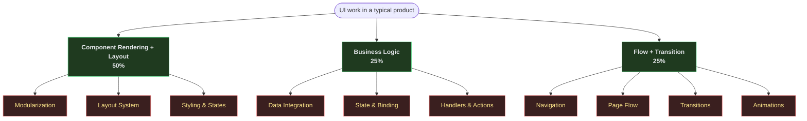

# Layers of UI work

Every UI product is a mix of three concerns. Source-crafter owns two of them (75%) and gives you a clean surface for the third.

- **Component Rendering + Layout (50%)** — engine-owned. Described in YAML; the engine parses, validates, and lays out.
- **Business Logic (25%)** — user-owned. You write providers (data fetching) and handlers (business rules); the engine wires them in by name.
- **Flow + Transition (25%)** — engine-owned. Navigation, page transitions, and animations are declared in YAML and driven by the engine.
